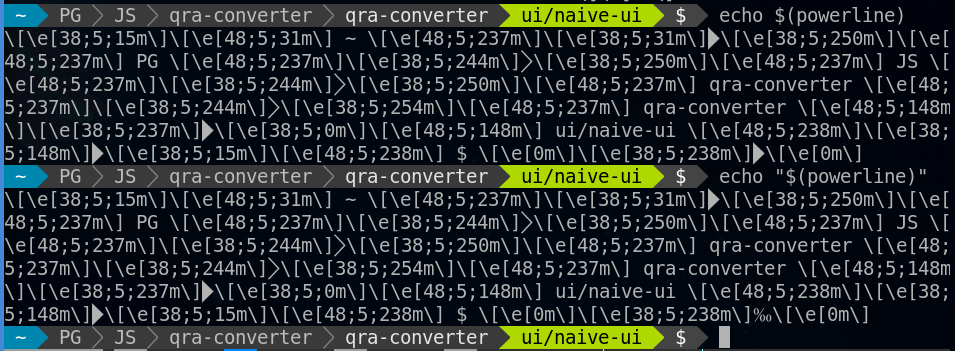

# TL;DR

それはいつものようにコーディングに取り掛かろうとした矢先のことでした。


私のシェルもついに反抗期を迎えたようです。

プロンプトの表示が突然おかしくなり、改行もされなくなってしまいました。

# 事象

プロンプトはpowerlineっぽい表示ですが、このプロンプトを生成するコマンドはRustで自作しています。

問題なのは、このプロンプトが**特定の文字数**になった時だけバグが起きてしまうということです。

つまり、プロンプトの表示幅が**64文字**になった時にだけこのような現象が生じたということです。

<br>

なので、例えばブランチ名を1文字だけ増やしたり減らしてみたりすると、この現象は解消されます。

# 原因

先に原因だけ書いてしまうと、プログラムの出力結果をPS1に反映させる部分に問題がありました。

具体的には以下のコードです。

```
// .bashrc

function _update_ps1() {
  PS1="$(~/bin/powerline $?)"
}
```

`powerline`コマンドの出力結果を文字列にして`PS1`に代入しています。

一見何の変哲もないこのコードですが、何が問題かは次の比較結果を見れば解ると思います。



なんと、`""`で括っただけで結果が変わってしまいましたね。。。

これがBashのバグなのか使用なのかは結局分かりませんでしたが、コマンドの出力結果をそのまま環境変数に代入するときは、`""`で括らないほうが良さそうです。

# 対処法

以下のように`""`で括らなくしてあげれば良いだけです。

```diff
-   PS1="$(~/bin/powerline $?)"
+   PS1=$(~/bin/powerline $?)
```

あるいはBack quotes(\`)を使っても良いでしょう。

```diff
-   PS1="$(~/bin/powerline $?)"
+   PS1=`~/bin/powerline $?`
```

# 補足：原因を見つけるまで

## プロンプト生成プログラムのテスト

プロンプトの表示を自作しているので、まず真っ先に自分が作ったプログラムを見直しました。

↓ブランチ名の長さを変えてコマンド出力結果を確認

```console
$ git branch -m ui/naive-ui
$ powerline
\[\e[38;5;15m\]\[\e[48;5;31m\] ~ \[\e[48;5;237m\]\[\e[38;5;31m\]\[\e[38;5;250m\]\[\e[48;5;237m\] PG \[\e[48;5;237m\]\[\e[38;5;244m\]\[\e[38;5;250m\]\[\e[48;5;237m\] JS \[\e[48;5;237m\]\[\e[38;5;244m\]\[\e[38;5;250m\]\[\e[48;5;237m\] qra-converter \[\e[48;5;237m\]\[\e[38;5;244m\]\[\e[38;5;254m\]\[\e[48;5;237m\] qra-converter \[\e[48;5;148m\]\[\e[38;5;237m\]\[\e[38;5;0m\]\[\e[48;5;148m\] ui/naive-ui \[\e[48;5;238m\]\[\e[38;5;148m\]\[\e[38;5;15m\]\[\e[48;5;238m\] $ \[\e[0m\]\[\e[38;5;238m\]\[\e[0m\] 
$ git branch -m ui/naiveui
$ powerline
\[\e[38;5;15m\]\[\e[48;5;31m\] ~ \[\e[48;5;237m\]\[\e[38;5;31m\]\[\e[38;5;250m\]\[\e[48;5;237m\] PG \[\e[48;5;237m\]\[\e[38;5;244m\]\[\e[38;5;250m\]\[\e[48;5;237m\] JS \[\e[48;5;237m\]\[\e[38;5;244m\]\[\e[38;5;250m\]\[\e[48;5;237m\] qra-converter \[\e[48;5;237m\]\[\e[38;5;244m\]\[\e[38;5;254m\]\[\e[48;5;237m\] qra-converter \[\e[48;5;148m\]\[\e[38;5;237m\]\[\e[38;5;0m\]\[\e[48;5;148m\] ui/naiveui \[\e[48;5;238m\]\[\e[38;5;148m\]\[\e[38;5;15m\]\[\e[48;5;238m\] $ \[\e[0m\]\[\e[38;5;238m\]\[\e[0m\] 
```

フォントの関係で一部豆腐文字が表示されていますが、ローカルで確認した限りでは問題は見当たりませんでした。

一応xxdでバイナリコードも確認してみましたが、両者の違いはブランチ名だけでした。

## 他のターミナルで試してみる

次に調査したのは自分が使用している`QTerminal`というアプリケーションです。出力が正しいならばレンダリング側（ターミナル）に問題があるのではないかと思われましたが、Neovim-qtのターミナルでも同じような事象が発生したため、どうやらターミナルの問題でもなさそうです。

## PS1への反映部分

完全に行き詰まって悩んでいた自分でしたが、ここで一つの疑問が浮かびました。

「そういえばPS1の値ってどうやって更新してるんだっけ？」

そんなふとした疑問から、`.bashrc`の内容を確かめてみました。

```
if [[ -x ~/bin/powerline ]]; then
    function _update_ps1() {
        PS1="$(~/bin/powerline $?)"
    }

    if [[ ! $PROMPT_COMMAND =~ _update_ps1 ]]; then
        PROMPT_COMMAND="_update_ps1;$PROMPT_COMMAND"
    fi
fi
```

今までコマンドの出力結果の文字列への埋め込みといえば`"$(...)"`のパターンが定石だと思っていましたが、そんな定石が崩れた瞬間でした。
