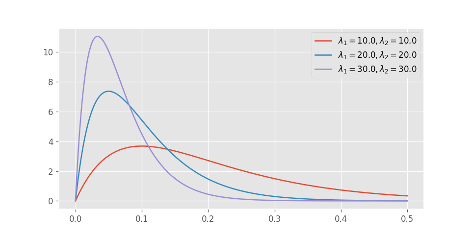
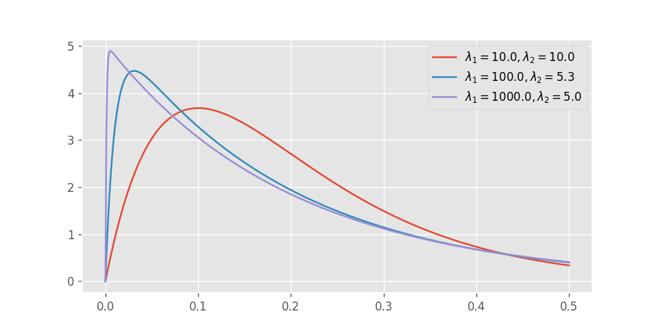

# きっかけ

※どうでも良いという方は読み飛ばしてもらっても結構です。

 

最近東京に引っ越してきて、改めて東京の人の多さに驚かされている。

出社した日にコンビニで昼食を買おうと思って入店したら、レジには長蛇の列。

 

「コロナの時代にこんな人混みの中に並ばなきゃいけないなんて...」

 

こんなご時世だからこそ、人が多くいる場所での滞在時間は1秒でも短くしたいというのが本音だ。

 

「勤務開始前に予め買っておけばいいじゃん。」

 

確かにそれも一理あるのだが、自分としては新鮮で温かいアメリカンドックとコーヒーが欲しいのだ。

会社の電子レンジが壊れているから、温め直すこともできない。

そんな訳で、昼食休憩が始まってから昼食を買いに行った結果、長蛇の列に並ぶ羽目になってしまったのだった。

# 待ち行列の理論

## 待ち行列とは？？

多数の顧客の動きを分析・予測する際、顧客の動きを状態遷移図で表すことがある。

例えば、コンビニに入店してから退出するまでの客の動きは、概ね以下のような状態遷移図で表すことができる。

1人1人の依存性や相関関係を考えるとややこしくなるので、ここではそれぞれの客が独立の確率分布に従って動いているとする。

このように多数の人や物質が独立に状態遷移するようなモデルを**待ち行列モデル**という。

待ち行列モデルの応用性は非常に広く、保険の仕組みや空港などの施設設計、サーバやルーターなどのハードウェア設計、物流システムなどにも応用されている。

## 無記憶性（マルコフ性）

待ち行列モデルの中でも特に多く見られるのが、**無記憶性**を持つ待ち行列モデルである。

無記憶性とは、将来のイベント発生（状態遷移）までの時間が過去の状態遷移に依らないということを意味する。

 

離散時間モデルの場合、以下のように定義される。

$$
P(s_{t + 1} | s_t, s_{t - 1}, \cdots , s_0) = P(s_{t + 1} | s_t)
$$

ここで、$s_t$は時刻$t$における状態を表す。

 

一方で連続時間の場合は以下のように定義される。

$$
P(s_{t + \Delta t}|s_\tau, \tau \leq t) = P(s_{t + \Delta t}|s_t)
$$

## 無記憶性を持つ待ち行列のイベント発生までの時間

無記憶性を持つ待ち行列モデルでは、状態遷移から次の状態遷移までの時間を考えると分かりやすい。

離散時間モデルでは、この時間は**幾何分布**に従い、連続時間では**指数分布**に従うからだ。

つまり一般的な待ち行列のモデルにおいて、それぞれの顧客の状態遷移が**無記憶性**を持つと仮定できる時、それぞれの顧客の状態遷移までの時間はこれらの分布で表すことができる。

# コンビニの待ち行列モデル

## 滞在時間のモデル化

先程のコンビニでの状態遷移モデルについて考えてみる。

各状態の滞在時間が無記憶性を持つかどうかについて議論の余地はあるかもしれないが、ここでは仮にこれらが無記憶性を持つと仮定する。

つまり、商品閲覧にかかる時間$t_1$とレジに要する時間$t_2$はそれぞれ独立に指数分布に従う。

## 滞在時間の確率分布

コンビニの滞在時間は$t_1 + t_2$に等しいので、この値の確率分布について考えてみる。

 

商品閲覧の平均滞在時間を$\lambda_1$、レジの平均滞在時間を$\lambda_2$とすろと、$t_1$と$t_2$の確率密度関数は以下のように表せる。

\begin{align*}
p(t_1) = \lambda_1 \exp(-\lambda_1 t_1) \\[0.5em]
p(t_2) = \lambda_2 \exp(-\lambda_2 t_2)
\end{align*}

$u = t_1 + t_2$, $v = t_2$として[確率変数の変換](https://zenn.dev/honehone/articles/2c204f5aec1d13)を適用することで以下を得る。

$$
p(u, v) = \lambda_1 \lambda_2 \exp\left\{(\lambda_1 - \lambda_2) v - \lambda_1 u\right\}
$$

$u \geq v$に注意しながらuの周辺密度関数を計算してみる。

\begin{align*}
p(u) &= \int_0^u p(u, v) \\
&= \lambda_1 \lambda_2 \exp(-\lambda_1 u) \int_0^u \exp\{(\lambda_1 - \lambda_2) v\} \\[0.5em]
&= \begin{dcases}
\lambda_1 \lambda_2 u \exp(-\lambda_1 u) & \text{if $\lambda_1 = \lambda_2$} \\[0.5em]
\frac{\lambda_1 \lambda_2}{\lambda_1 - \lambda_2} \left\{\exp(-\lambda_2 u) - \exp(-\lambda_1 u)\right\} & \text{if $\lambda_1 \neq \lambda_2$}
\end{dcases}
\end{align*}

ここで重要なのは、**指数分布同士の足し算が指数分布にならない（再生性を持たない）**という事実である。

正規分布や二項分布、カイ二乗分布などの有名な分布が再生性を持つ一方で、指数分布は再生性を持たず、和の確率分布も複雑な形となる。

 

一般に、指数分布に従う独立な確率変数の和が従う分布を[Hypoexponential distribution](https://en.wikipedia.org/wiki/Hypoexponential_distribution)という。

特に、すべての指数分布のパラメータが同じ時は[Erlang distribution](https://en.wikipedia.org/wiki/Erlang_distribution)と呼ばれ、Poisson過程において重要な役割を果たす。

先程の式は、自由度2のHypoexponential distributionの確率密度関数を表している。

## 確率密度関数の可視化

式を見ただけではサッパリ分からないので、いくつかパラメータを選んで可視化してみる。

 

 

グラフをまず見て気がつくのは、この関数には極値が存在するということである。

そして2つの指数分布のパラメータの差が大きいほど、片方の分布から受ける影響が強くなり、極値が0に近づくということも見て取れる。

 

無記憶性を持つモデルを仮定したときに、一つのイベント発生までの時間にこのような山が見られるときは、背後に複数の状態遷移が存在している可能性を疑ったほうが良いのかもしれない。

こういった場合には状態を細分化することで、より正確なモデリングが可能となる。

# 滞在時間を意識したコンビニ設計

あなたがコンビニの内装設計者であるとき、混雑を避けるためにはどのようにすればよいのだろうか。

当然予算やスペースは限られているので、その中でいくつかのプランを検討することになる。

## 1. 一定時間以上の滞在をなるべく避ける

１つのアプローチとしては、**客が一定時間以上滞在する確率が一番小さくなるプランを選択する**という手法が考えられる。

先程のモデルに当てはめると、以下の値が最も小さくなるようなプランを考えるということになる。

\begin{align*}
P(u \geq T) &= \int_T^{\infty} p(u) du \\[0.5em]
&= \frac{1}{\lambda_1 - \lambda_2} \left\{\lambda_1 \exp(-\lambda_2 T) - \lambda_2 \exp(-\lambda_1 T)\right\}
\end{align*}

ただしこのモデルの場合**T**未満の滞在時間を全く考慮に入れていないので、**コンビニ内の客の数を少なくする**という観点から見ると不適切かもしれない。

## 2. 滞在時間の期待値を最小化する

別のアプローチとして、客の滞在時間の期待値を最小化するという方法が考えられる。

この方法は、**店内の平均客数の最小化**を行いたいときに有効である。

最適なプランを見つけるには、単純に$\text{E}[u] = \frac{1}{\lambda_1} + \frac{1}{\lambda_2}$の値を最小化すれば良い。

この方法のデメリットとしては、客が少ない場合でも考慮に入れられてしまうので、**ただ混雑するのを避けたい**という目的の場合には別のアプローチを検討したほうがいいだろう。

# 計算の簡略化

## 離散化による近似

Hypoexponential distributionはその特性上、式が煩雑であり、積分計算もコストが大きい。

これを避けるために、実際の現場では時間の離散化による近似が用いられることが多い。

つまり、時間を微小区間に切り分け、それぞれの区間における状態を代入することで、離散時間モデルとして扱うことができる。

微小区間の幅を小さくすればするほどモデルの精度は高くなるが、あまり細かくしすぎると浮動小数点誤差の影響を受けやすくなるので注意する必要がある。

## 離散化の注意点

連続時間でかつ無記憶性を持つモデルを離散化する時、状態遷移図を書き換える必要がある。

時間を一つ進めるたびに何度でも状態遷移しうるので、例えば状態数が5つの場合を離散化したモデルは次のようになる。

## 遷移確率行列の計算

時間区間の幅を$\Delta t$、CからDに遷移するまでの時間を$t_{CD}$, DからEに遷移するまでの時間を$t_{DE}$とする。

Cの状態にあるものが次の時刻にDにいる確率は次のように求められる。

\begin{align*}
P(s_{t + \Delta t} = D|s_t = C) &= P(s_{t + \Delta t} \in \{D, E\}|s_t = C) - P(s_{t + \Delta t} = E|s_t = C) \\[0.5em]
&= P(t_{CD} < \Delta t) - P(t_{CD} + t_{DE} < \Delta t)
\end{align*}

$t_{CD}, t_{DE}$は指数分布に従うので、各自積分することにより遷移確率を求めることができる。

同じ要領ですべての状態遷移の確率を求めることができる。

## データから直接遷移確率行列を直接求める

上のように指数分布のパラメータから遷移確率行列を求めることも可能であるが、各顧客がそれぞれの時刻にどの状態にいたのかが分かっている場合、遷移確率行列を直接算出することができる。

### ①状態sに留まる確率

各顧客で状態$s$が観測された回数の総和を$n_s$とし、その中で次の時刻にも状態$s$にいた回数を$n_{ss}$とすると、求める確率は$n_{ss} / n_s$に等しい。

### ②状態s→s'に遷移する確率

各顧客で状態$s$が観測された回数のうち、次の時刻に状態$s'$にいた確率を$n_{ss'}$とすると、求める確率は$n_{ss'}$に等しい。

## 具体例

顧客Pと顧客Qの状態が以下のように表されているとする。

<table style="width:40%; margin:0 auto">
  <tr>
    <th>時刻</th>
    <th>P</th>
    <th>Q</th>
  </tr>
  <tr>
    <td style="text-align:right">0</td>
    <td style="text-align:center">A</td>
    <td style="text-align:center">A</td>
  </tr>
  <tr>
    <td style="text-align:right">1</td>
    <td style="text-align:center">B</td>
    <td style="text-align:center">A</td>
  </tr>
  <tr>
    <td style="text-align:right">2</td>
    <td style="text-align:center">B</td>
    <td style="text-align:center">A</td>
  </tr>
  <tr>
    <td style="text-align:right">3</td>
    <td style="text-align:center">C</td>
    <td style="text-align:center">A</td>
  </tr>
  <tr>
    <td style="text-align:right">4</td>
    <td style="text-align:center">C</td>
    <td style="text-align:center">B</td>
  </tr>
  <tr>
    <td style="text-align:right">5</td>
    <td style="text-align:center">C</td>
    <td style="text-align:center">C</td>
  </tr>
</table>

このとき、状態Aが観測された回数は全部で5回、そのうちAに留まった回数が3回、Bに遷移した回数が2回なので、Aに留まる確率は3/5、A→Bに遷移する確率は2/5と求められる。

同様にしてすべての遷移確率を求めると、遷移確率行列は次のようになる。

$$
P = \begin{bmatrix}
\frac{3}{5} & \frac{2}{5} & 0 \\
0 & \frac{1}{3} & \frac{2}{3} \\
0 & 0 & 1 \\
\end{bmatrix}
$$

このようにして求めた行列は、真の遷移確率行列に対する最尤推定量に等しいことが知られている（[https://www.stat.cmu.edu/~cshalizi/462/lectures/06/markov-mle.pdf](https://www.stat.cmu.edu/~cshalizi/462/lectures/06/markov-mle.pdf)）。

# 各状態の滞在時間に相関がある場合

以上の議論は、各々の状態の滞在時間が独立であると仮定しているが、実際にはこれらは独立ではないことのほうが多い。

例えばコンビニの場合、たくさん買い物した人は商品閲覧とレジの所要時間は両方長くなるだろうし、逆に飲み物だけ買いに来た人~~（自動販売機で買ってくれ）~~は両方とも短い時間で済むだろう。

 

この場合は、Hypoexponential distributionもマルコフ連鎖の枠組みも当てはまらないため、さらに複雑なモデリングが必要となる。

この問題は突き詰めていくと終わりが見えなくなりそうなので、今日はこの辺りで一旦筆を休めることにする。

# 最後に

コンビニの内装の設計は意外に奥が深いことが分かった。

内装設計者の頭を悩ませないためにも、混雑する時間の買い物はなるべく避けるのが人情かもしれない。

また健康のことを考えれば、アメリカンドックにこだわるよりもバランスの良い食事を心がけるべきだろう。

 

改めて自分の生活習慣を見直す良い機会になったのではないかと感じている。
